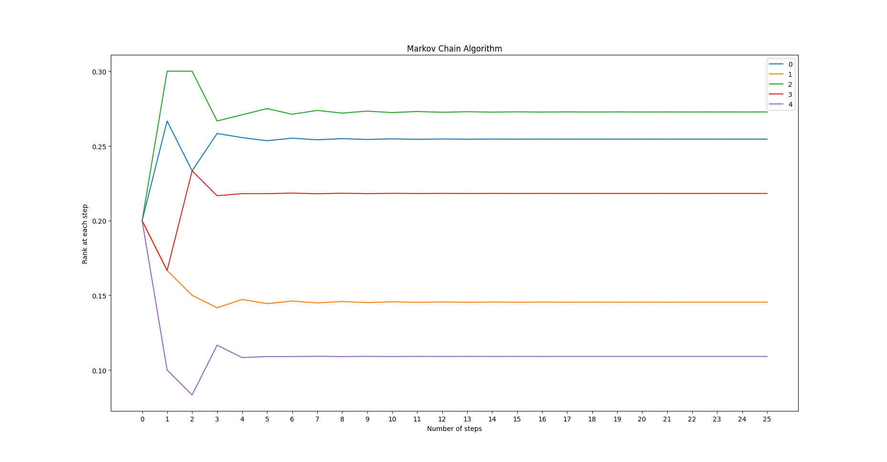

# The PageRank Citation Ranking: Bringing Order to the Web

## Description

The importance of a Web page is an inherently subjective matter, which depends on the readers interests, knowledge and attitudes. But there is still much that can be said objectively about the relative importance of Web pages. Link the [orginal paper](http://ilpubs.stanford.edu:8090/422/1/1999-66.pdf) and a [video explaination](https://www.youtube.com/watch?v=JGQe4kiPnrU).

## Requirment

Requirments are python3 and,

```console
pip install numpy
```

## How to run?

`web_network` is an example of web-network. For key `0` we have value `{2, 3}` this means there is an outward edge from `0` to `2` and `3`.

```
web_network = {
    0: set([2, 3]),
    1: set([2]),
    2: set([0, 1, 3]),
    3: set([0, 4]),
    4: set([0])
}
```

We need to create an instance for `Markov_Chain` with a predefined network in our case as `web_network`, or simply not specifying any input during instance creation `Markove_Chain()`.

```
www = Markov_Chain(web_network)
```

We can add new edge by using `+=` operator. For example we need to add an edge from `4` to `1`, the command will be,

```
www += (4, 1)
```

### Note

All web pages must have an outgoing url.

To get the top `n` pages of the from `web_network` run,

```
n = 5
pg = www.top(n)
print(pg)
```

Output will be,

```
meesumaliqazalbash@MAQsPC:python3 The-PageRank-Citation-Ranking-Bringing-Order-to-the-Web/ranking.py
[2, 0, 3, 1, 4]
```

Rank saturation can be seen in the graph below for the above web network.


